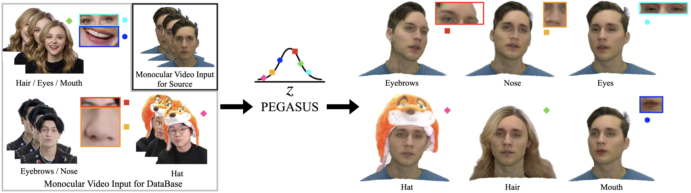

<div align="center">

<h1>PEGASUS: Personalized Generative 3D Avatars with Composable Attributes</h1>

<div>
    <a href='https://hyunsoocha.github.io/' target='_blank'>Hyunsoo Cha</a>&emsp;
    <a href='https://bjkim95.github.io/' target='_blank'>Byungjun Kim</a>&emsp;
    <a href='https://jhugestar.github.io/' target='_blank'>Hanbyul Joo</a>
</div>
<div>
    Seoul National University
</div>
<div>
    <a href='https://snuvclab.github.io/pegasus/'>CVPR 2024</a>
</div>
<div>

<a target="_blank" href="https://arxiv.org/abs/2402.10636">
  
</a>
</div>

<h4>TL;DR</h4>
<h5>PEGASUS builds a personalized generative 3D face avatar from monocular video sources.</h5>

### [Paper](https://arxiv.org/abs/2402.10636) | [Project Page](https://snuvclab.github.io/pegasus/)

<br>
<tr>
    
</tr>
</div>

## News
- [2024/04/23] Initial release.

## Setup
NOTE: PEGASUS was tested in an Ubuntu 20.04, CUDA 11.8 environment.
All experiments were conducted using eight RTX A6000 GPUs. Training can be significantly slower in environments that do not support multi-GPU setups.

### Environment
We need many modified open-source modules, so please make the directory (e.g., $HOME/GitHub)
```
mkdir -p $HOME/GitHub/
cd $HOME/GitHub/
git clone https://github.com/snuvclab/pegasus.git
cd ./scripts
sudo chmod a+x ./install_conda.sh
./install_conda.sh
```
Dockerfile will be provided soon.

### Downloads
NOTE: The preprocessing process and the files that need to be downloaded are heavily dependent on the preprocess instructions of [IMAvatar](https://github.com/zhengyuf/IMavatar).

* Download FLAME pkl and sam_vit_h_4b8939.pth. Please register FLAME website first.
```
cd ./scripts
./download_data.sh
```
* Download [deca_model.tar](https://drive.google.com/file/d/1rp8kdyLPvErw2dTmqtjISRVvQLj6Yzje/view?usp=sharing) and put into `./preprocess/DECA/data`
* Download [modnet_webcam_portrait_matting.ckpt](https://drive.google.com/file/d/1Nf1ZxeJZJL8Qx9KadcYYyEmmlKhTADxX/view?usp=sharing) and put into `./preprocess/MODNet/pretrained/`
* Download [79999_iter.pth](https://drive.google.com/open?id=154JgKpzCPW82qINcVieuPH3fZ2e0P812) and put into `./preprocess/face-parsing.PyTorch/res/cp/`

## Synthetic DB Generation
### To prepare
Currently, we cannot release the pretrained DB avatar and monocular video database $V^{db}$ due to an issue with our download server. Instead, we recommend several datasets or videos that can be used for our synthetic DB generation.
1. [Weird](https://www.youtube.com/watch?v=Iy0akbbmJOI): We highly recommend this YouTube channel. Most of our $V^{db}$ content is sourced from it.
2. [Syuka World](https://youtu.be/vjvQQGeH6Ug?si=Yh8kOFdqUb1PJz6e): Highly recommended for a diverse range of hat datasets.
3. [Celebv-HQ](https://celebv-hq.github.io/): We did not use this dataset for our paper, but it contains high-quality monocular videos. We are concerned that it lacks a variety of head poses, so please choose cautiously.

There are certain conditions for using the synthetic database.
1. We recommend using at least 100 processed monocular videos to generate a synthetic database. 
2. Exclude any frames with occlusions from the videos. We leverage [frankmocap](https://github.com/facebookresearch/frankmocap) to detect the hand and [YOLOv5](https://github.com/ultralytics/yolov5) to detect the objects.
3. All of the videos should be cropped $512\times512$.
We plan to release preprocessing code that automatically crops and excludes noisy frames.

### Processing
NOTE: We largely follow [IMAvatar](https://github.com/zhengyuf/IMavatar)'s structure for datasets and training checkpoints.
```
mkdir -p ./data
mkdir -p ./data/datasets
mkdir -p ./data/experiments
```
1. Set the video file name as filename.mp4
2. Save the video to ./data/datasets/original_db/filename.mp4
3. Please run a script to create the monocular video database $V^{db}$. Be sure to edit the preferences at the top of the script."
```
sudo chmod a+x ./preprocess/*.sh
./preprocess/1_initial_original_db.sh
```
4. Generate DB Avatar using $V^{db}$. This script includes the rendering.
```
sudo chmod a+x ./run/db_avatar.sh
./run/db_avatar.sh
```
5. Generate synthetic database.
```
./preprocess/2_synthesis_eyebrows.sh
./preprocess/2_synthesis_eyes.sh
./preprocess/2_synthesis_hair.sh
./preprocess/2_synthesis_hat.sh
./preprocess/2_synthesis_mouth.sh
./preprocess/2_synthesis_nose.sh
./preprocess/3_source.sh
```

## PEGASUS training
### from scratch
```
./run/train.sh
```

### pretrained model
We plan to release the pretrained model soon.

## PEGASUS test
```
./run/test.sh
```

## License
Codes are available only for non-commercial research purposes.

## Acknowledgement
Our project is built based on PointAvatar. We sincerely thank the authors of
- [PointAvatar](https://github.com/zhengyuf/PointAvatar) 
- [I M Avatar](https://github.com/zhengyuf/IMavatar) 
- [Face Parsing](https://github.com/zllrunning/face-parsing.PyTorch) 
- [DECA](https://github.com/yfeng95/DECA) 
- [FLAME](https://github.com/soubhiksanyal/FLAME_PyTorch) 
for their amazing work and codes!

## Citation
If you find our code useful, please cite our paper:

```
@inproceedings{cha2024pegasus,
    author = {Cha, Hyunsoo and Kim, Byungjun and Joo, Hanbyul},
    title = {PEGASUS: Personalized Generative 3D Avatars with Composable Attributes}, 
    booktitle = {Proceedings of the IEEE/CVF Conference on Computer Vision and Pattern Recognition (CVPR)},
    year = {2024},
}
```